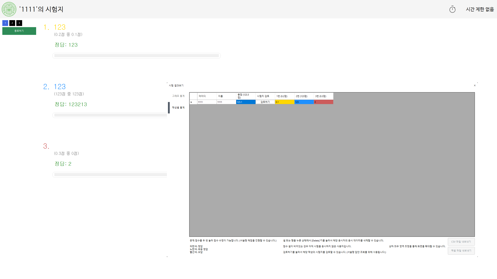

> [!IMPORTANT]
> 
> 이하 내용은 모두 Private Repositroy로 등록되어 있는 프로젝트에 관한 설명입니다. 
> 
> 열람이 필요한 경우 요청바랍니다.

# 시험 관리 시스템 (EMS)

> 시험 관리 프로그램 (Examination Management System)

[시험 관리 시스템](https://github.com/OverTook/Examination) 은 C# 클라이언트와 PHP 서버를 이용하여 구동되는 시험 관리 프로그램입니다.

부정 행위를 방지하고자 하는 만큼 주요 기능은 다음과 같습니다.

1. [Alt + Tab], [Alt + F4], [Ctrl + Alt + Del] 등 다양한 Key Input 제어

2. 주 모니터를 제외한 나머지 모니터를 차단



<br>

## Getting Started / 어떻게 시작하나요?

## Server / 서버

> [!WARNING]
> 
> 현재 서버는 PHP로 개발되어 있으나 이후 토큰 기반의 인증 방식으로 바꾸기 위하여 Go언어로 Conversion이 이루어질 예정입니다.

### Prerequisites / 선행 조건

시험 관리 시스템의 서버를 구동하기 위해서는 아래 조건을 만족해야 합니다.

> APM

만약, APM이 설치되어 있지 않다면 다음 과정을 통해 설치할 수 있습니다.

여기서는 명령어로 설치하는 방법을 다루며, 그래픽 인터페이스를 사용할 수 있는 상황이라면 직접 설치할 수 있습니다.

#### Ubuntu

```shell
sudo apt update
sudo apt install apache2
sudo apache2ctl -v

sudo ufw allow 'Apache'

sudo apt-get install php
sudo apt install mysql-server -y
```

#### Windows

> [!TIP]
> 
> Apache, PHP, MySQL 버전은 원하는 버전으로 바꿀 수 있습니다.

PHP 설치

```cmd
curl -o php.zip https://windows.php.net/downloads/releases/php-8.3.7-Win32-vs16-x64.zip
tar -xf php.zip -C C:\php
cd C:\php
copy php.ini-production php.ini

powershell -Command "(Get-Content php.ini) -replace ';extension=pdo_mysql', 'extension=pdo_mysql' | Set-Content php.ini"
```

MySQL 설치

```cmd
curl -o mysql-installer.msi https://dev.mysql.com/get/Downloads/MySQLInstaller/mysql-installer-web-community-8.0.26.0.msi
msiexec /i mysql-installer.msi /quiet
"C:\Program Files\MySQL\MySQL Server 8.0\bin\mysqld" --initialize-insecure
"C:\Program Files\MySQL\MySQL Server 8.0\bin\mysqld" --install
net start MySQL
```

Apache 설치

```cmd
curl -o httpd.zip https://www.apachelounge.com/download/VS17/binaries/httpd-2.4.59-240404-win64-VS17.zip
tar -xf httpd.zip -C C:\Apache24
cd C:\Apache24\conf
echo LoadModule php_module "c:/php/php7apache2_4.dll" >> httpd.conf
echo AddType application/x-httpd-php .php >> httpd.conf
echo PHPIniDir "c:/php" >> httpd.conf
```

<br>

### Installing / 설치

해당 Repository의 최신 Release 파일을 내려받아 수동으로 파일을 이동하거나, 아래 명령어를 통해 설치할 수 있습니다.

#### Ubuntu

```shell
git clone https://github.com/OverTook/Examination.git /tmp/Examination
sudo cp -r /tmp/Examination/PHPServer/* /var/www/html/
sudo chown -R www-data:www-data /var/www/html
sudo chmod -R 755 /var/www/html
sudo systemctl restart apache2
```

#### Windows

```cmd
git clone https://github.com/OverTook/Examination.git C:\TEMP_DIR\Examination
xcopy C:\TEMP_DIR\Examination\PHPServer\* C:\Apache24\htdocs /E /H /Y
```

<br>

## Client / 클라이언트

> [!CAUTION]
> 
> Windows 환경 이외에는 클라이언트를 실행할 수 없습니다.

### Prerequisites / 선행 조건

시험 관리 시스템의 클라이언트를 구동하기 위해서는 아래 조건을 만족해야 합니다.

> C# 8.0

Windows 환경을 만족하면서 C#이 설치되어 있지 않다면 명령 프롬프트에서 아래 명령어를 통해 설치할 수 있습니다.

```cmd
winget install Microsoft.DotNet.SDK.8
```

<br>

### Installing / 설치

해당 Repository의 최신 Release 파일을 내려받거나, 아래 명령어를 통해 내려받은 후 직접 컴파일을 진행할 수 있습니다.

```cmd
gh repo clone OverTook/Examination
```


## 업데이트 내역

- 2024 / 05 / 01
  
  - 레포지토리 생성

- 2024 / 05 / 02
  
  - 프로젝트 파일 생성

- 2024 / 05 / 05
  
  - 해상도 대응, MessageBox 추가
  
  - 로그인 및 회원가입 창 작업

- 2024 / 05 / 07
  
  - 시험 창 기능 구현
  
  - 종료 방지 기능 버그 수정
  
  - 출제자용 UI 제작

- 2024 / 05 / 08
  
  - 시험 삭제 기능 디자인
  
  - 팝업창 관련 리팩토링

- 2024 / 05 / 10
  
  - 문제 생성 화면 제작

- 2024 / 05 / 11
  
  - 문제 추가 창 및 서버 기초 작업

- 2024 / 05 / 12
  
  - PHP 서버 제작

- 2024 / 05 / 14
  
  - 시험 결과창 UI 제작
  
  - PHP 추가 작업 및 DKIM 서명 (인증 메일 시스템 관련)

- 2024 / 05 / 15
  
  - API 연동 및 버그 수정
  
  - API Endpoint 변경 (맥미니 자체 서버 제작)
  
  - DKIM 서명 삭제 (Oracle Cloud DKIM 삭제)

- 2024 / 05 / 16
  
  - 사진 Upload 작업

- 2024 / 05 / 17
  
  - 사진 Upload 완료

- 2024 / 05 / 18
  
  - 시험 출제 기능 구현 완료
  
  - 문제 추가 기능 작업

- 2024 / 05 / 19
  
  - 문제 추가 기능 구현 완료

- 2024 / 05 / 20
  
  - 출제자 기능 구현 완료

- 2024 / 05 / 21
  
  - DPI별 해상도 작업 완료
  
  - 해상도 대응 2차 작업
  
  - 버그 수정

- 2024 / 05 / 24
  
  - 버그 수정

- 2024 / 05 / 26
  
  - 응시자용 기능 구현 시작

- 2024 / 05 / 27
  
  - 시험 응시 기능 구현 완료
  
  - 문제 삭제 기능 구현 시작
  
  - 버그 수정

- 2024 / 05 / 28
  
  - 시험 출제 기능 추가 구현
  
  - 학생 메인 페이지 디자인 변경
  
  - 채점 & 검토 기능 구현

- 2024 / 05 / 29
  
  - 시험 결과 보기 창 구현 시작

- 2024 / 05 / 30
  
  - 시험 결과 보기 창 작업

- 2024 / 05 / 31
  
  - 기능 구현 마무리
  
  - 버그 수정

- 2024 / 06 / 01
  
  - 기완성
  
  - 코드 최적화 및 C# 버전 변경 (7.3 > 8.0)


## 할 일 / TODO List

- [x] 기능 완성

- [ ] 코드 리팩토링
  
  - [ ] DTO 사용
  
  - [ ] 중복 코드 제거

- [ ] 서버 언어 변경


## 기여 방법 / How to contribute

1. Private Repository에 권한을 부여할 수 있게 본 레포지토리에 Issue를 올려주세요.

2. 권한을 부여받은 Private Repository를 포크합니다.

3. 새 브랜치를 만듭니다.

4. 작업 후 커밋합니다.

5. 브랜치에 푸시합니다.

6. 풀리퀘스트를 보내주세요.
